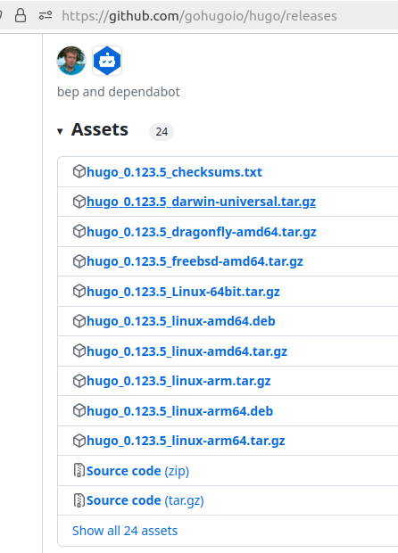
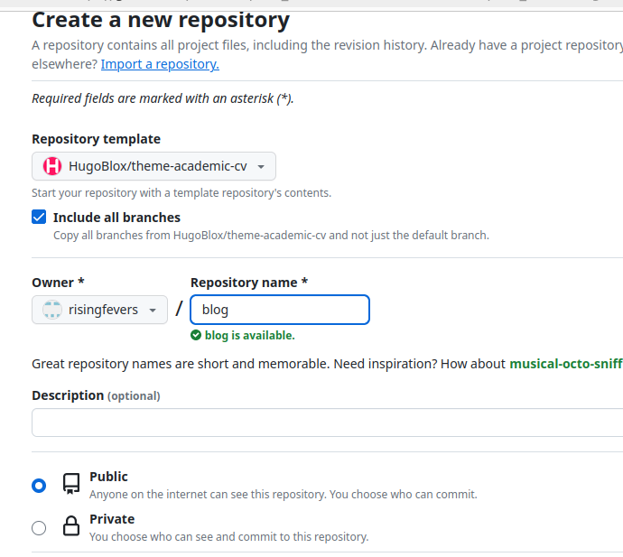
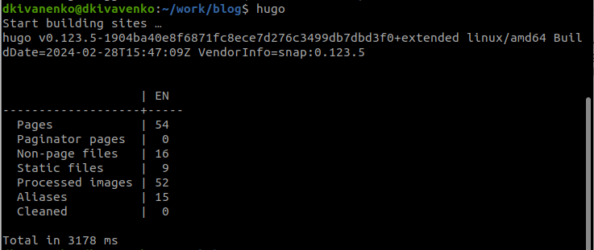
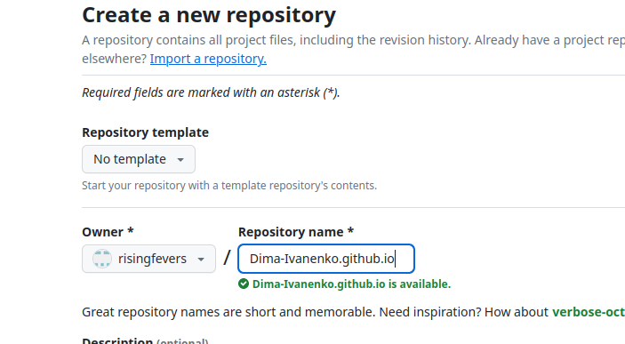
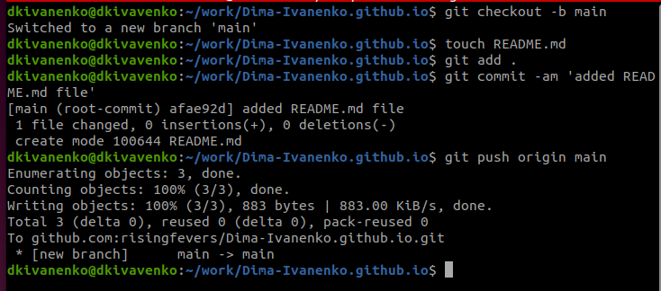
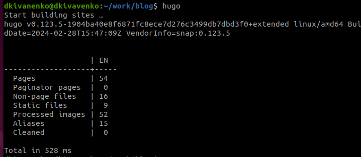
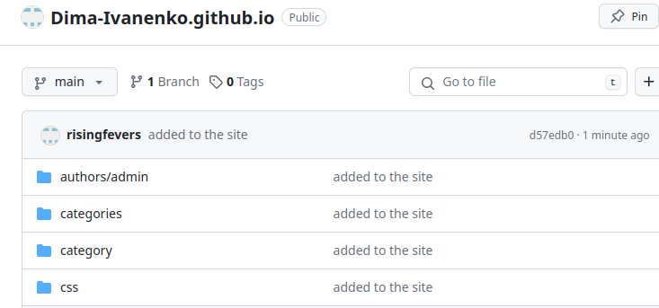

---
## Front matter
title: "Презентация по проекту, этап №1"
subtitle: "Предмет: Операционные системы"
author: "Иваненко Дмитрий Кириллович"

## Generic otions
lang: ru-RU
toc-title: "Содержание"

## Bibliography
bibliography: bib/cite.bib
csl: pandoc/csl/gost-r-7-0-5-2008-numeric.csl

## Pdf output format
toc: true # Table of contents
toc-depth: 2
lof: true # List of figures
lot: true # List of tables
fontsize: 12pt
linestretch: 1.5
papersize: a4
documentclass: scrreprt
## I18n polyglossia
polyglossia-lang:
  name: russian
  options:
	- spelling=modern
	- babelshorthands=true
polyglossia-otherlangs:
  name: english
## I18n babel
babel-lang: russian
babel-otherlangs: english
## Fonts
mainfont: PT Serif
romanfont: PT Serif
sansfont: PT Sans
monofont: PT Mono
mainfontoptions: Ligatures=TeX
romanfontoptions: Ligatures=TeX
sansfontoptions: Ligatures=TeX,Scale=MatchLowercase
monofontoptions: Scale=MatchLowercase,Scale=0.9
## Biblatex
biblatex: true
biblio-style: "gost-numeric"
biblatexoptions:
  - parentracker=true
  - backend=biber
  - hyperref=auto
  - language=auto
  - autolang=other*
  - citestyle=gost-numeric
## Pandoc-crossref LaTeX customization
figureTitle: "Рис."
tableTitle: "Таблица"
listingTitle: "Листинг"
lofTitle: "Список иллюстраций"
lotTitle: "Список таблиц"
lolTitle: "Листинги"
## Misc options
indent: true
header-includes:
  - \usepackage{indentfirst}
  - \usepackage{float} # keep figures where there are in the text
  - \floatplacement{figure}{H} # keep figures where there are in the text
---

# Цель работы

Разместить на github pages заготовку персонального сайта.

# Задачи

1. Скачать необходимое ПО
2. Скачать шаблон темы сайта
3. Разместить его на github
4. Разместить параметр для URL сайта
5. Разместить заготовку сайта на github pages

# Выполнение Лабораторной Работы 

1) Скачиваю с github релиз для своей системы, рис.1
заранее проверил архитектуру своей системы командой
sudo --print-architecture

{#fig:001 width=70%}

2) Распаковываю файлы, рис.2

{#fig:001 width=70%}

3) Создаем каталог bin в основной директории, переносим туда файл 
'hugo', рис.3

{#fig:001 width=70%}

4) Захожу на репозиторий макета и создаю на его основе свой новый
репозиторий, рис.4

{#fig:001 width=70%}

{#fig:001 width=70%}

5) Перехожу в ~/work и копирую новый репозиторий туда с помощью git clone:

{#fig:001 width=70%}

6) Скачиваю go, он нужен для работы, рис.7

{#fig:001 width=70%}

7) Пишу hugo чтобы начать создание сайта, рис.8

{#fig:001 width=70%}

8) Пишу mc и удаляю public файл:

{#fig:001 width=70%}

9) Запускаю сайт с помощью hugo server, рис.10.
Там же беру ссылку на сайт, рис.11

{#fig:001 width=70%}

{#fig:001 width=70%}

10) Перехожу по ссылке, вот сайт:

{#fig:001 width=70%}

11) Далее создаю новый репозиторий, с именем 
Dima-Ivanenko.guthub.io, рис.13

{#fig:001 width=70%}

12) Перехожу в ~/work, туда клонирую новый репозиторий:

{#fig:001 width=70%}

13) Переходим на ветку main, рис.15

{#fig:001 width=70%}

14) Перехожу в файл репозитория.
Создаю файл README.md и отправляю его на сервер, рис.16

{#fig:001 width=70%}

15) Выполняем программу, чтобы наша директория подключилась к репозиторию.

{#fig:001 width=70%}

16) Далее комментируем #public в редакторе, рис.18

{#fig:001 width=70%}

17) Повторяем неудавшуюся команду:

{#fig:001 width=70%}

18) Пишем hugo

{#fig:001 width=70%}

19) Далее проверяем в директории public, получилось ли подключить, рис.21

{#fig:001 width=70%}

20) Отправляем на сервер github

{#fig:001 width=70%}

21) Проверяю, получилось ли на сайте:

{#fig:001 width=70%}

# Выводы

В процессе выполнения первого этапа проекта, мы научились
размещать на github pages заготовки персонального сайта.

